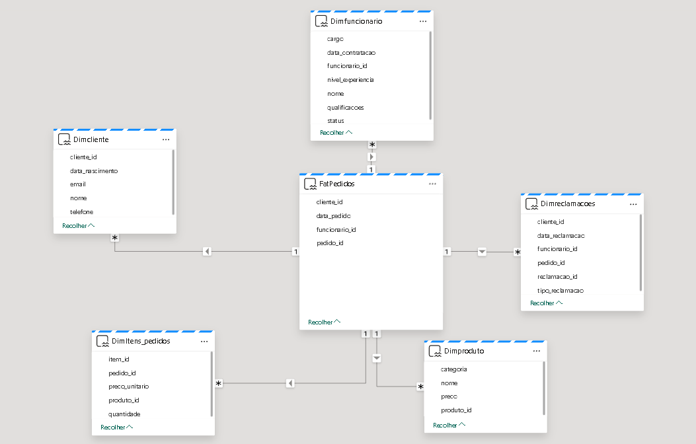

# Análise das Reclamações Frequentes de Clientes e Queda no Número de Pedidos

*Dados Gerados pelos Alunos*  

**Data do Relatório:** 08/05/2024  

## Sobre o conjunto de dados  

Este repositório contém um conjunto de dados gerado artificialmente, projetado para simular situações reais enfrentadas por empresas em termos de operações de vendas e atendimento ao cliente. Este dataset serve como base para a análise de reclamações frequentes de clientes e identificação de fatores associados à redução no número de pedidos.

## Descrição dos Dados  

Os dados simulam interações de clientes, operações de venda, e feedback de serviços, incluindo:

• *Pedidos com detalhes de data, produto, e quantidade.*

• *Reclamações categorizadas por tipo e associadas a pedidos específicos.*

• *Informações de funcionários associados a cada transação.*

## Conjunto de Dados Modelo Estrela DW

*Visão Geral do Banco de Dados*

O conjunto de dados para este projeto é armazenado no banco de dados denominado "lanchonete_beth", que está configurado no ambiente Microsoft Fabric. Este banco de dados contém diversas tabelas que são cruciais para a análise e operações diárias da lanchonete.

• FatPedidos
Descrição: Central para o modelo estrela, esta tabela armazena as transações de pedidos. Cada registro representa um pedido único e inclui medidas quantitativas como quantidade de itens vendidos e valores financeiros.

• DimItensPedidos
Descrição: Contém detalhes sobre os itens individuais em cada pedido, como quantidade e preço unitário.

• DimProduto
Descrição: Armazena informações sobre os produtos vendidos.

• DimFuncionario
Descrição: Detalhes sobre os funcionários que gerenciam ou realizam os pedidos.

• DimCliente
Descrição: Contém informações sobre os clientes.

• DimReclamacoes
Descrição: Registra reclamações associadas a pedidos.

## Aplicações e Cenários  

Problema Principal: Reclamações frequentes de clientes e uma queda notável no
número de pedidos.

Aspectos Específicos do Problema:
Reclamações de Clientes: Identificar os principais motivos das reclamações, como
tempo de espera, qualidade da comida, atendimento ao cliente, etc.
Queda no Número de Pedidos: Analisar os períodos de declínio nas vendas e associá-los
a fatores internos (como mudanças no menu, alterações nos preços, qualidade do
serviço).

Os dados são utilizados para:

1. Analisar as Causas das Reclamações Frequentes de Clientes
Objetivo: Identificar e entender os principais motivos por trás das reclamações frequentes dos clientes para poder endereçar e mitigar essas questões de forma eficaz.
Análise: Utilizar métodos de categorização para agrupar reclamações por tipo e analisar a frequência e as condições sob as quais ocorrem. Ferramentas analíticas podem ser usadas para identificar padrões ou correlações entre as reclamações e variáveis operacionais ou de produto.2. Investigar os Fatores que Contribuem para a Queda no Número de Pedidos

2. Investigar os Fatores que Contribuem para a Queda no Número de Pedidos
Objetivo: Compreender as razões por trás da redução nos volumes de pedidos para reverter essa tendência ou adaptar a estratégia de negócios conforme necessário.
Análise: Avaliar as tendências de vendas ao longo do tempo com um foco particular nos períodos de declínio. Analisar as mudanças internas (como alterações de inventário ou política de preços) e externas (como condições econômicas ou ações de concorrentes) que podem influenciar esses números.

3. Desenvolver Estratégias para Melhorar a Satisfação do Cliente e Eficiência Operacional
Objetivo: Aumentar a satisfação do cliente e otimizar as operações para garantir um serviço eficiente e eficaz que possa impulsionar o crescimento e a rentabilidade do negócio.
Análise: Medir e analisar a satisfação do cliente através de pesquisas e feedback direto. Examinar processos operacionais para identificar gargalos ou ineficiências que possam afetar a experiência do cliente.

## Exploração e Visualização de Dados  
*Objetivo:* O processo de exploração e visualização de dados é crucial para transformar grandes volumes de dados brutos em insights acionáveis. Este processo abrange desde a preparação inicial dos dados até a apresentação final de informações em formatos visuais compreensíveis.

*Componentes Principais:*

*Data Lake:*
    Descrição: Um data lake armazena grandes volumes de dados em seu formato natural (bruto). Ele é fundamental para organizações que coletam dados de várias fontes em diferentes formatos, pois permite uma flexibilidade significativa na manipulação e análise desses dados.
    Função: No contexto deste projeto, o data lake serve como o repositório primário onde todos os dados coletados são armazenados antes de serem processados. Isso inclui dados gerados, logs de sistema, dados de transações, e mais.
*Data Pipeline:*
    Descrição: Um data pipeline é um conjunto de operações de dados sequenciais automatizadas, destinadas a permitir a transferência e transformação de dados de uma fonte para um destino.
    Função: Para este projeto, o pipeline é responsável por extrair dados do data lake, transformá-los (limpeza, agregação e enriquecimento), e carregá-los no data warehouse ou em ferramentas de visualização. Este processo é crucial para garantir que os dados estejam prontos para análise e visualização no Power BI.
*Consultas SQL:*
    Descrição: SQL (Structured Query Language) é uma linguagem de programação utilizada para gerenciar e manipular bancos de dados relacionais.
    Função: As consultas SQL são utilizadas para extrair dados específicos do data warehouse, baseando-se em critérios definidos. No contexto deste projeto, são utilizadas para analisar o desempenho dos funcionários, gerenciar reclamações dos clientes, e observar as tendências de vendas e pedidos.
*Power BI:*
    Descrição: Power BI é uma ferramenta de visualização de dados e business intelligence que permite transformar dados de várias fontes em dashboards interativos e relatórios analíticos.
    Função: No projeto, o Power BI é usado para criar visualizações impactantes e dashboards que facilitam a interpretação dos dados. Ele permite aos stakeholders visualizar tendências, padrões e outliers rapidamente, facilitando a tomada de decisões baseada em dados.
*Documentação do Projeto:*
    Descrição: A documentação é um aspecto crítico de qualquer projeto de dados, proporcionando um registro detalhado do design do sistema, arquitetura de dados, processos de desenvolvimento, e insights derivados das análises.
    Função: Para este projeto, a documentação inclui detalhes sobre a estrutura do data warehouse, descrições das tabelas e campos, um registro das consultas SQL utilizadas, e explicações das visualizações desenvolvidas no Power BI. Ela serve como um manual para usuários e desenvolvedores, facilitando a manutenção e escalabilidade do sistema e garantindo que novos membros da equipe possam entender e contribuir para o projeto eficazmente.

*Importância:* A exploração e visualização de dados no contexto deste projeto são essenciais para identificar rapidamente áreas de melhoria na operação da empresa, avaliar o impacto de diferentes estratégias, e monitorar a saúde operacional e financeira da organização de forma contínua. A capacidade de visualizar complexas interações de dados de forma intuitiva é crucial para transformar dados em ações estratégicas eficazes.

## Resultados  

Os dados coletados e analisados revelam insights significativos, que são fundamentais para o direcionamento futuro das atividades da organização.

1. Desempenho dos Funcionários
Objetivo: Analisar o número total de pedidos gerenciados por cada funcionário, categorizados por nome e cargo.
Descrição: Esta consulta mede a produtividade dos funcionários com base no número de pedidos que cada um gerencia. Através dela, a empresa pode identificar quais funcionários estão desempenhando acima ou abaixo das expectativas e ajustar cargas de trabalho ou reconhecer desempenho.

2. Tipo de Reclamação e Funcionário Associado
Objetivo: Identificar os tipos de reclamações e quantificar cada tipo, associando-os aos respectivos funcionários responsáveis pelos pedidos.
Descrição: Esta consulta ajuda a identificar áreas problemáticas nos produtos ou serviços, ligando reclamações específicas aos funcionários que as gerenciaram. Isso pode indicar necessidades de treinamento ou ajustes em produtos/serviços.

3. Análise da Queda nos Pedidos
Objetivo: Examinar as tendências mensais nos números de pedidos e receitas, identificando possíveis declínios.
Descrição: Essa consulta fornece uma visão mensal sobre o desempenho de vendas, ajudando a identificar meses com baixo desempenho em volume e valor de vendas. Isso permite investigar causas de variações sazonais ou eventuais problemas operacionais.

4. Desempenho Detalhado dos Funcionários
Objetivo: Avaliar o desempenho individual dos funcionários com base em sua experiência, data de contratação, e número de reclamações associadas.
Descrição: Essa consulta detalha o impacto do nível de experiência e da data de contratação sobre as reclamações associadas a cada funcionário. Isso pode indicar a eficácia das políticas de contratação e treinamento.

5. Análise das Reclamações por Data e Tipo
Objetivo: Monitorar o volume e os tipos de reclamações ao longo do tempo para identificar padrões ou picos específicos.
Descrição: Esta consulta permite visualizar como diferentes tipos de reclamações se distribuem ao longo dos meses, facilitando a identificação de problemas recorrentes ou sazonais e a eficácia de medidas corretivas implementadas.

6. Total de Vendas de Produtos
Objetivo: Analisar o total de vendas de produtos por categoria e mês, permitindo identificar quais categorias estão performando melhor ou pior em determinados períodos.
Descrição: Esta consulta fornece uma visão clara das vendas por categoria de produto em cada mês, ajudando a planejar estratégias de marketing, promoções e ajustes de estoque baseados no desempenho de vendas, e ajudou a provar que não houve queda de pedidos relacionada aos produtos.

## Conclusão  

*Influência do Desempenho dos Funcionários na Queda dos Pedidos:*
A análise dos dados mostrou que determinados funcionários estavam consistentemente associados a um maior número de reclamações e a uma redução nos pedidos. Particularmente, os dados extraídos das consultas 1, 2 e 4 revelaram que funcionários com menor nível de experiência ou aqueles recém-contratados enfrentavam desafios significativos que afetavam suas performances. Por exemplo, a consulta 4, que detalhou o desempenho dos funcionários em termos de reclamações e experiência, indicou que os novatos ou aqueles com experiência insuficiente contribuíam para um número desproporcional de reclamações.

*Relação entre Reclamações e Queda de Pedidos:*
As análises das consultas 2 e 5 mostraram que tipos específicos de reclamações estavam frequentemente ligados a uma diminuição subsequente nos pedidos durante períodos subsequentes, conforme demonstrado na consulta 3. Isso sugere que as reclamações não eram apenas incidentes isolados, mas sim indicativos de problemas mais profundos que afetavam a percepção e a satisfação do cliente.

*Medidas Implementadas:*
Diante dessas descobertas, a empresa implementou um programa abrangente de treinamento e certificação para todos os funcionários, com um foco especial nos recém-contratados e naqueles cujos desempenhos estavam abaixo das expectativas. O objetivo era melhorar as competências essenciais, como atendimento ao cliente, gestão de reclamações, e eficiência operacional. A certificação foi usada não apenas como uma ferramenta de avaliação, mas também como um incentivo para o desenvolvimento profissional contínuo.

*Impacto das Soluções Implementadas:*
Após a implementação dessas medidas, observou-se uma melhoria notável no desempenho dos funcionários. As reclamações diminuíram significativamente, e houve uma recuperação gradual no número de pedidos. A relação direta entre o aumento da competência dos funcionários e a melhoria nos indicadores de performance reafirma a importância de investimentos contínuos em treinamento e desenvolvimento profissional.

Essa análise demonstra claramente como a capacitação e a melhoria das habilidades dos funcionários são cruciais para reversão de tendências negativas no desempenho empresarial. Portanto, continuar a investir em treinamento e desenvolvimento é essencial para manter a competitividade e a satisfação do cliente em longo prazo.